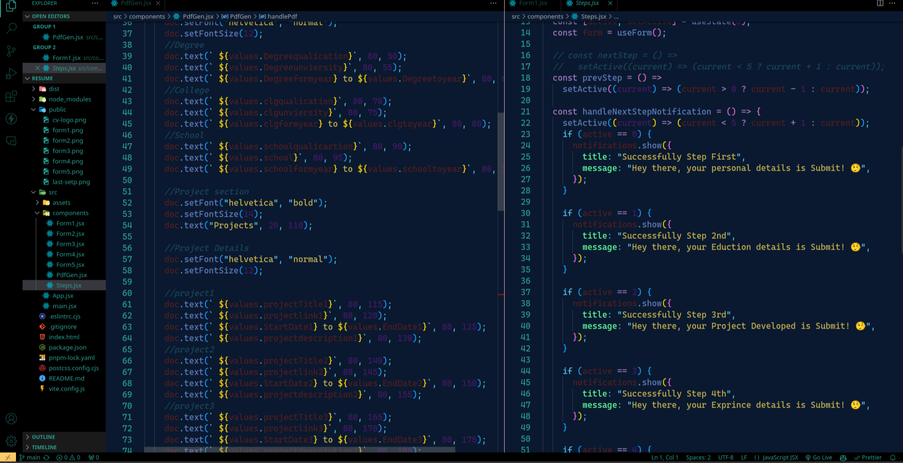

<h1 align="center">
  GKB Theme 
</h1>

  

### This is the made Dark Theme

## Installation via VS Code

1. Open **Extensions** sidebar panel in VS Code. `View → Extensions`
2. Search for `Bharti`
3. Click on **Bharti Theme**
4. Click **Install** to install it
5. Click **Reload** to reload the editor
6. Code > Preferences > Color Theme > **Bharti Theme**
